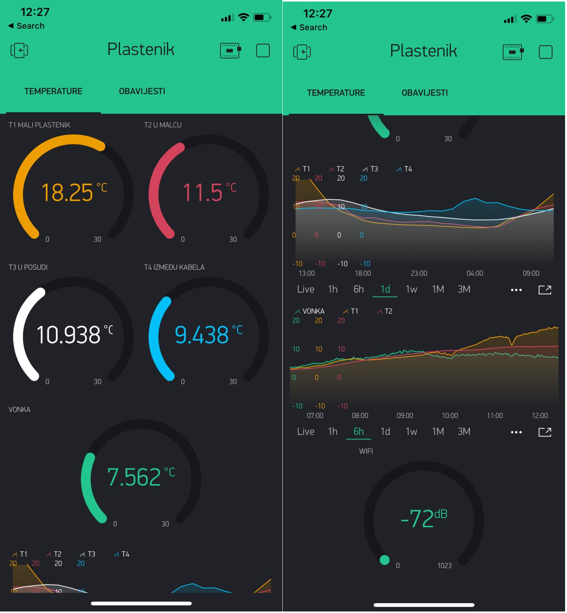
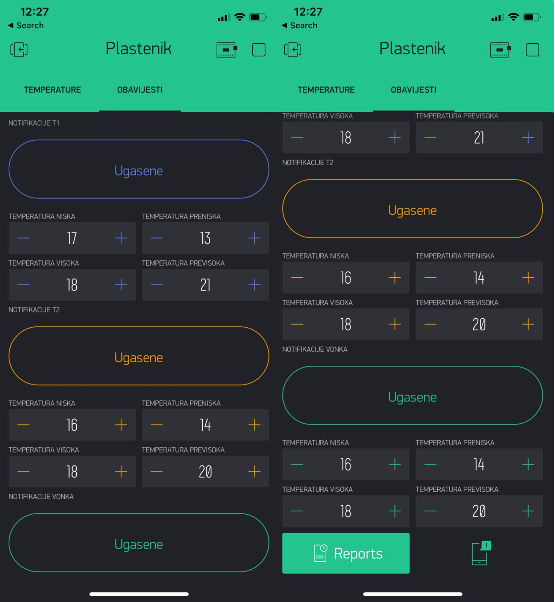

# Collecting-temperatures-in-the-greenhouse-notification-when-the-temperature-exceeds-a-certain-value
# Prikupljanje temperatura u plasteniku, obavještavanje kad temperatura prijeđe određenu vrijednost

The user has an insight into current and historical measurements of temperatures in the greenhouse via the blynk application interface. It also has the ability to manage notifications by which it is notified when the temperature value from a particular sensor exceeds the set value and thus prevents any damage that would occur if the user was not notified of the event. (Events to be notified: temperature high, temperature too high, temperature low, temperature too low).

Korisnik putem sučelja blynk aplikacije ima uvid u trenutna i povijesna mjerenja temperatura u plasteniku. Ima i mogućnost upravljanja notifikacijama kojima bude obaviješten  kad vrijednost temperature sa određenog senzora prijeđe postavljenu vrijednost i na taj način spriječi eventualno štetu koja bi se dogodila da korisnik nije obaviješten o događaju. (Događaji o kojima bude obaviješten : temperatura visoka, temperatura previsoka, temperatura niska, temperatura preniska).

.jpg)
.jpg)

Components used: nodemcu (ESP8266), 5x ds18b20 waterproof temperature sensors, power supply, Blynk, 35 m cable.

Korištene komponente: nodemcu(ESP8266), 5x ds18b20 vodonepropusnih senzora temperature, napajanje, Blynk, 35 m kabela.

Senzori su postavljeni na različitim mjestima unutar i izvan plastenika. U svrhu prikapljanja podataka o kretanju temperature kroz godinu i unaprijeđenja procesa uzgoja. 

Sensors are placed at different locations inside and outside the greenhouse. In order to collect data on temperature trends throughout the year and improve the cultivation process.

.jpg)

Through the interface of the Blynk application, in the "TEMPERATURE" tab, the user has a view of current and historical temperature measurements, he can export data and manipulate them as desired. It also has insight into the wifi signal strength of the microcontroller.

Putem sučelja Blynk aplikacije, u tab-u "TEMPERATURE"korisnik ima prikaz trenutnih i povijesnih mjerenja temperature, može I eksportati podatke pa s njima manipulirati po želji. Ima uvid i u jačinu wifi signala mikrokontrolera. 

In the "OBAVIJESTI" tab, notifications can be managed via the Blynk application. Notifications are related to three of the five installed sensors. The user can turn notifications on or off for each of the sensors separately. It can also manage event values for notifications for each of the sensors. Events to be notified: temperature high, temperature too high, temperature low, temperature too low. Therefore, the user can adjust the events for which notifications will come to a certain period or season. In winter, low temperature notifications are useful to prevent frost or freezing. In summer, high temperature notifications are useful so that the plants do not die from too high a temperature. During autumn and spring, notifications for too low and too high temperatures are useful because meteorological extremes can occur and thus possible damage to the greenhouse.

U tab-u „OBAVIJESTI“ može se upravljati notifikacijama putem Blynk aplikacije. Notifikacije su vezane za tri od pet postavljenih senzora. Korisnik može uključiti ili isključiti notifikacije za svaki od senzora odvojeno. Može i upravljati vrijednostima događaja pri kojima će dolaziti  notifikacije za svaki od senzora.  Događaji o kojima bude obaviješten : temperatura visoka, temperatura previsoka, temperatura niska, temperatura preniska.  Stoga korisnik može prilagoditi događaje pri kojima će dolaziti notifikacije određenom periodu ili godišnjem dobu. Zimi su korisne notifikacije o niskoj temperaturi da ne dođe do mraza ili zamrzavanja. Ljeti su korisne notifikacije o visokoj temperaturi da biljke ne uginu od previskoke temperature. Tijekom jeseni i proljeća su korisne notifikacije za prenisku i previsoku temperaturu jer može doći do meteoroloških ekstrema a tako i eventualne štete u plasteniku. 

